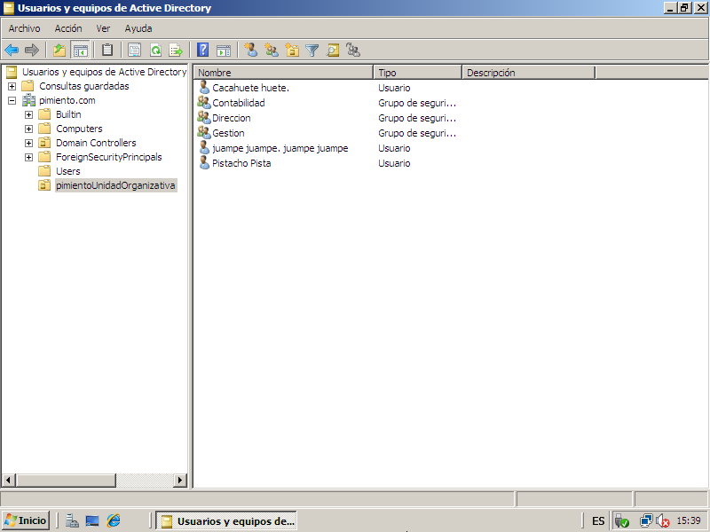
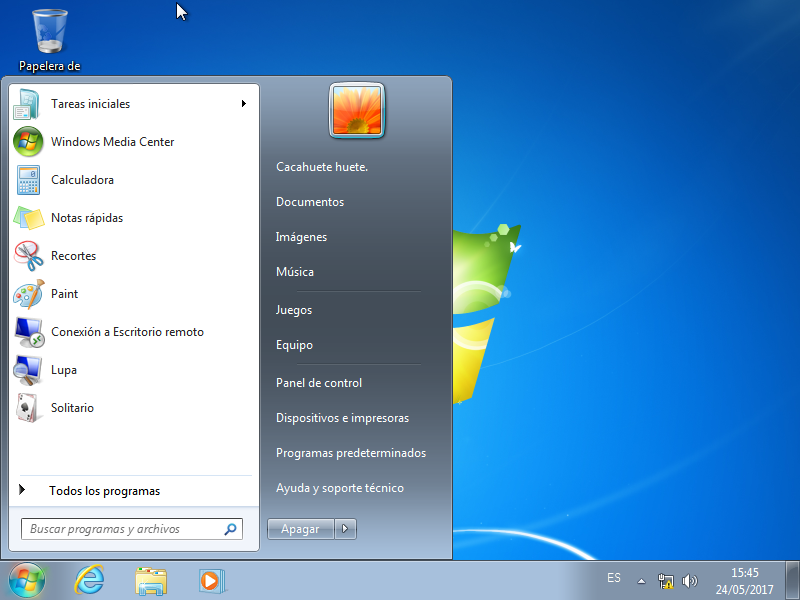

# EjercicioWindowsServer2008

Organizacion del dominio con los usuarios, grupos y unidad organizativa:   

  
Usuario 1:   
   
  
  
Usuario 2:  
  
  
  
Usuario 3:  
   
  
  
Accediendo a la pagina web del dominio desde un usuario:  
  
  
